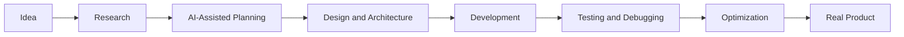

<div align="center">


<a href="https://git.io/typing-svg">
  
</a>

<br/>


<a href="https://github.com/WhiteArt666?tab=followers">
  
</a>

<a href="https://github.com/WhiteArt666">
  
</a>

</div>

---

## 👋 About Me

```typescript
const nguyenNhatDuy = {
  username: "WhiteArt666",
  role: "Software Engineer",
  location: "Ho Chi Minh City, Vietnam",
  university: "HUFLIT",
  major: "Software Engineering",

  mindset: [
    "Technology over language boundaries",
    "Build products, not just source code",
    "Use AI as an engineering accelerator",
    "Learn fast and adapt to new trends",
    "Combine engineering with creativity"
  ],

  capabilities: [
    "Software Development",
    "Backend and Frontend Engineering",
    "Database Design",
    "UI/UX Design",
    "System Thinking",
    "AI-Assisted Development",
    "Product Prototyping"
  ],

  currentMission:
    "Transform ideas into useful, scalable and visually engaging digital products."
};
```

I am a **Software Engineering student and technology enthusiast** who enjoys exploring the entire process of creating digital products.

I do not define myself by a single programming language, framework or technical role. My main goal is to understand problems, choose suitable technologies and turn ideas into practical solutions.

My interests go beyond traditional development. I enjoy working across:

* Software engineering and application development
* Backend systems and API development
* Frontend and interactive user experiences
* Database modeling and data processing
* UI/UX design and visual thinking
* AI-assisted development and automation
* Product ideas, prototyping and system architecture

I actively use AI to research, prototype, debug, improve designs and accelerate software development. I see AI not as a replacement for engineering knowledge, but as a powerful tool that helps engineers learn faster, experiment more and build better products.

---

## 🧠 My Engineering Philosophy

```text
Understand the problem.
Choose the right technology.
Design a clear solution.
Use AI to accelerate execution.
Validate, improve and keep learning.
```

I believe a modern Software Engineer should be able to:

* Adapt quickly to new technologies
* Understand both technical and user perspectives
* Work across multiple layers of a product
* Use AI responsibly and effectively
* Learn concepts instead of depending on one framework
* Balance performance, usability and maintainability

---

## 🤖 AI-Driven Workflow

AI is an important part of how I learn and build software.



I use AI to support:

* Requirement analysis and technical research
* Architecture and database brainstorming
* Code generation and refactoring
* Debugging and issue investigation
* UI concepts and design exploration
* Documentation and test-case generation
* Rapid prototyping and experimentation
* Learning unfamiliar technologies faster

> AI helps me move faster, but engineering thinking determines where to go.

---

## 🚀 Technology Ecosystem

### Programming Languages

<p>
  
</p>


### Backend and Application Development

<p>
  
</p>


### Frontend and Mobile

<p>
  
</p>


### Database and Data

<p>
  
</p>


### Design and Creative Tools

<p>
  
</p>


### Engineering Tools

<p>
  
</p>


---


**Technology**

`Next.js` `React` `TypeScript` `Tailwind CSS` `MongoDB` `Stripe` `Clerk`

---

### 🤖 AI-Powered Learning Platform

An interactive learning platform that uses AI to enhance the user experience and support modern digital education.

**Technology**

`React` `TypeScript` `Tailwind CSS` `AI Integration`

---

### 🐾 Flutter Pet Shop

A mobile e-commerce application built with Flutter.

**Technology**

`Flutter` `Dart` `Provider` `REST API`

---

## 🔭 What I Am Exploring

```yaml
current_focus:
  engineering:
    - Software architecture
    - Full-stack product development
    - Database design and optimization
    - Secure and scalable applications
    - Testing and maintainable code

  artificial_intelligence:
    - AI-assisted software development
    - Intelligent automation
    - AI product integration
    - Prompt engineering
    - Rapid prototyping with AI

  creative_technology:
    - Modern UI and UX
    - Interactive web experiences
    - Three-dimensional web interfaces
    - Motion and visual storytelling
    - Product design thinking

  infrastructure:
    - Docker
    - Deployment workflows
    - CI/CD
    - Cloud platforms
    - System monitoring
```

---


---

## 📈 Contribution Activity

<div align="center">


</div>

---

## 🐍 Contribution Snake

<div align="center">

<picture>
  <source
    media="(prefers-color-scheme: dark)"
    srcset="https://raw.githubusercontent.com/WhiteArt666/WhiteArt666/output/github-contribution-grid-snake-dark.svg"
  />
  <source
    media="(prefers-color-scheme: light)"
    srcset="https://raw.githubusercontent.com/WhiteArt666/WhiteArt666/output/github-contribution-grid-snake.svg"
  />
  
</picture>

</div>

---

## 🎯 My Direction

I am working toward becoming a modern **Software Engineer** who can participate in the complete product-building process.

My direction is not limited to becoming a developer who only writes code. I want to develop the ability to:

* Analyze real-world problems
* Design complete software solutions
* Select suitable technologies
* Build across frontend, backend and database layers
* Create intuitive user experiences
* Use AI to increase development speed and quality
* Adapt quickly as technology continues to evolve

---

## 🤝 Connect With Me

<div align="center">

<a href="mailto:YOUR_EMAIL">
  
</a>

<a href="YOUR_LINKEDIN_URL">
  
</a>

<a href="https://github.com/WhiteArt666">
  
</a>

</div>

<br/>

<div align="center">

### ⚡ Build Beyond Boundaries

> I do not want to be limited by a programming language, framework or job title.
> I want to understand technology deeply enough to turn ideas into real products.

<br/>


</div>
